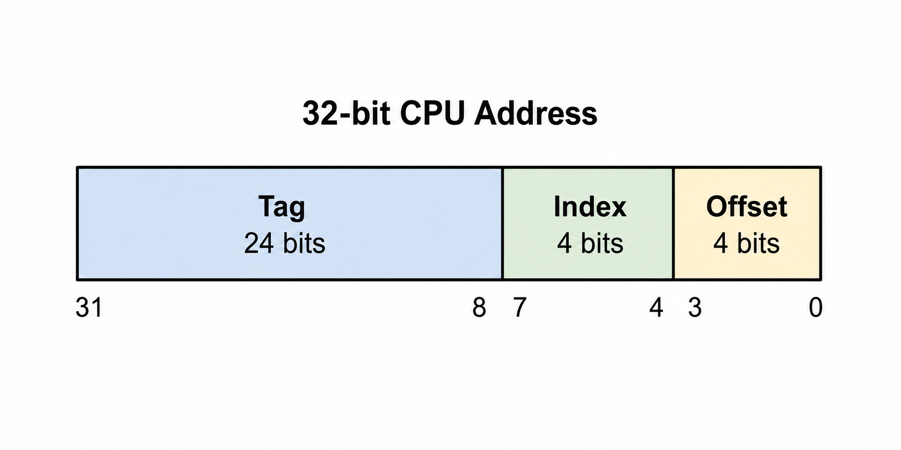
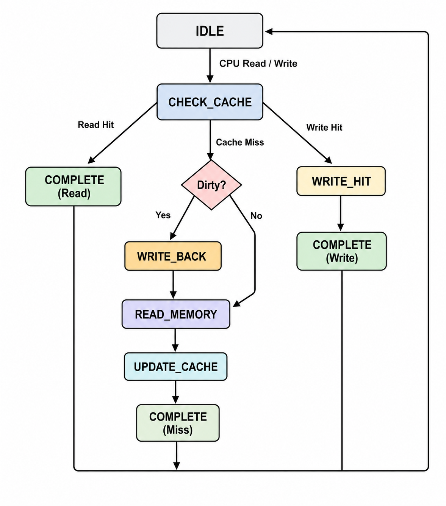
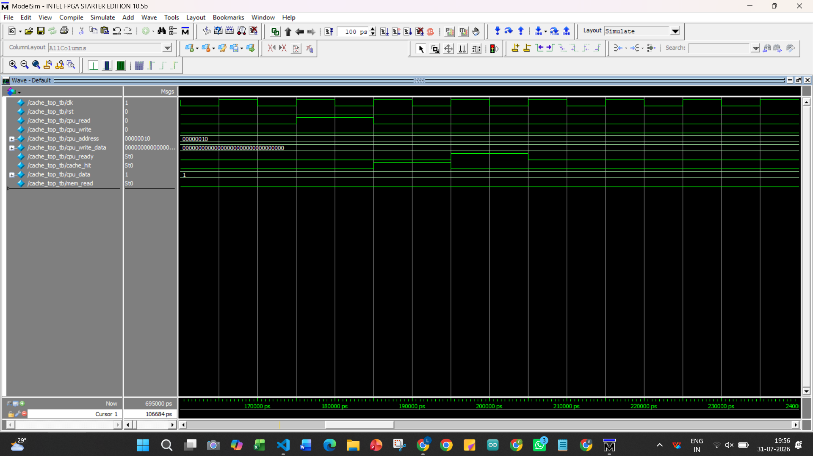
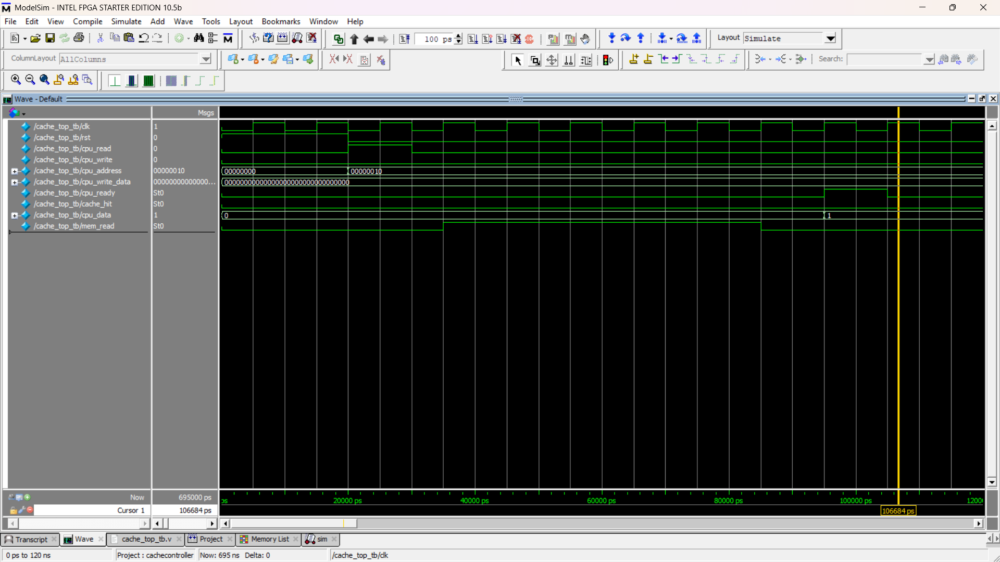
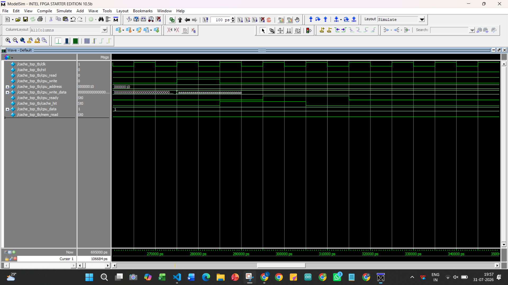
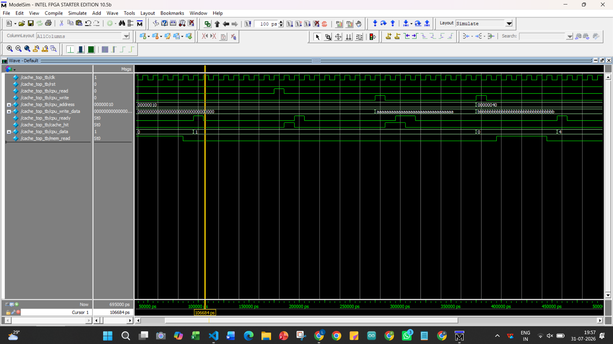
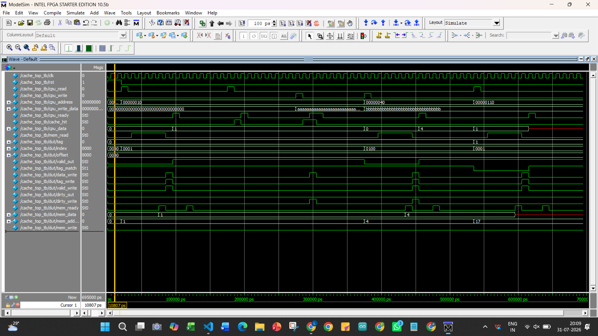

<div align="center">
  
# Direct-Mapped Cache Controller


**A parameterized Verilog implementation of a Direct-Mapped Write-Back Write-Allocate Cache Controller with configurable memory latency.**

</div>

---

## Project Overview

This project presents the design and implementation of a parameterized **Direct-Mapped Cache Controller** using Verilog HDL. The cache follows a **Write-Back** and **Write-Allocate** policy to improve memory access efficiency by reducing the average memory access time.

The controller supports cache read and write operations, cache hit and miss detection, dirty bit management, valid bit tracking, tag comparison, and communication with the main memory. A configurable memory latency model is also included to emulate realistic memory behavior.

The design has been developed using modular RTL architecture, verified through simulation, and organized for easy scalability and reuse.

## Features

- Direct-Mapped Cache Architecture
- Write-Back Cache Policy
- Write-Allocate Policy
- Parameterized Cache Design
- Configurable Main Memory Latency
- Cache Hit and Cache Miss Detection
- Tag Comparison Logic
- Valid Bit and Dirty Bit Management
- Separate Data, Tag, Valid, and Dirty Arrays
- Modular RTL Design for Easy Reusability
- External Memory Initialization using `$readmemh`
- Functional Verification using a Verilog Testbench

  ## Cache Specifications

| Parameter | Value |
|----------|-------|
| Cache Organization | Direct-Mapped |
| Write Policy | Write-Back |
| Allocation Policy | Write-Allocate |
| Number of Cache Lines | 16 |
| Block Size | 128 bits (16 Bytes) |
| Tag Width | 24 bits |
| Index Width | 4 bits |
| Offset Width | 4 bits |
| Address Width | 32 bits |
| Memory Initialization | `$readmemh()` |
| Main Memory Latency | Configurable |
| RTL Language | Verilog HDL |

## Project Architecture

The cache controller is organized into modular RTL components, separating the control path from the data path. The controller FSM manages cache operations, while dedicated modules handle data storage, tag comparison, valid bits, dirty bits, and communication with the main memory.
<p align="center">
  
</p>

<p align="center">
  <b>Figure 1:</b> Architecture of the Direct-Mapped Write-Back Write-Allocate Cache Controller.
</p>

## RTL Module Description

| Module | Description |
|---------|-------------|
| **cache_top.v** | Top-level module that integrates all cache components and interfaces with the CPU and main memory. |
| **controller_fsm.v** | Implements the finite state machine (FSM) that controls cache operations, including read/write requests, cache hits, cache misses, and memory transactions. |
| **data_array.v** | Stores the cache data blocks for each cache line. |
| **tag_array.v** | Stores the tag corresponding to each cache line for address comparison. |
| **valid_bit_array.v** | Maintains the valid bit for each cache line to indicate whether stored data is valid. |
| **dirty_bit_array.v** | Maintains the dirty bit for each cache line to determine whether modified data must be written back to main memory. |
| **comparator.v** | Compares the requested tag with the stored cache tag to determine cache hits and misses. |
| **main_memory.v** | Models the main memory with configurable access latency and external memory initialization using `$readmemh`. |
| **cache_top_tb.v** | Functional testbench used to verify cache behavior under different read and write scenarios. |

## Address Format

The cache controller uses a **32-bit CPU address**, which is divided into three fields to access the cache efficiently.

| Field | Width | Description |
|-------|------:|-------------|
| **Tag** | 24 bits | Used to identify the memory block stored in the cache line. |
| **Index** | 4 bits | Selects one of the 16 cache lines. |
| **Offset** | 4 bits | Selects the byte within the 128-bit (16-byte) cache block. |


<p align="center">
  
</p>

<p align="center">
<b>Figure 2:</b> 32-bit Address Division into Tag, Index, and Offset fields.
</p>

### Address Breakdown

- **Tag (24 bits):** Identifies whether the requested memory block is present in the selected cache line.
- **Index (4 bits):** Selects one of the 16 cache lines.
- **Offset (4 bits):** Selects the required byte within the 16-byte cache block.

## Controller Finite State Machine (FSM)

The cache controller is implemented using a Finite State Machine (FSM) that manages all cache operations, including cache hit detection, cache miss handling, write-back operations, memory access, and cache updates. The FSM coordinates communication between the CPU, cache arrays, and main memory to ensure correct data flow.

<p align="center">
  
</p>

<p align="center">
<b>Figure 3:</b> Finite State Machine controlling cache operations.
</p>

### FSM States

| State | Description |
|--------|-------------|
| **IDLE** | Waits for a CPU read or write request. |
| **CHECK_CACHE** | Checks the valid bit and compares the requested tag with the stored tag. |
| **WRITE_HIT** | Updates the cache data and sets the dirty bit on a write hit. |
| **WRITE_BACK** | Writes dirty cache data back to main memory before replacement. |
| **READ_MEMORY** | Fetches the requested block from main memory on a cache miss. |
| **UPDATE_CACHE** | Updates the cache with the fetched block and writes the new tag and valid bit. |
| **COMPLETE** | Signals completion of the current cache transaction and returns to the IDLE state. |

### FSM Operation

The controller begins in the **IDLE** state and waits for a CPU request.

- On a **cache hit**, read requests are completed immediately, while write requests update the cache and set the dirty bit.
- On a **cache miss**, the controller checks whether the existing cache line is dirty.
- If the cache line is dirty, the controller performs a **write-back** operation before fetching the requested block from main memory.
- The fetched block is stored in the cache, the tag and valid bit are updated, and the controller signals completion to the CPU before returning to the **IDLE** state.

## Working Principle

The cache controller processes CPU read and write requests by checking whether the requested data is available in the cache. Based on the cache status, it performs one of the following operations.

### Read Hit
1. CPU issues a read request.
2. The controller checks the valid bit and compares the requested tag with the stored tag.
3. If both match, the requested data is read directly from the cache.
4. The controller signals completion to the CPU.

### Write Hit
1. CPU issues a write request.
2. The controller updates the corresponding cache block.
3. The dirty bit is set to indicate that the cache line has been modified.
4. The controller signals completion to the CPU.

### Read/Write Miss (Clean Line)
1. The requested block is not present in the cache.
2. Since the selected cache line is clean, no write-back is required.
3. The controller fetches the required block from main memory.
4. The cache is updated with the new block and tag.
5. The CPU request is completed.

### Read/Write Miss (Dirty Line)
1. The requested block is not present in the cache.
2. The selected cache line contains modified data (dirty bit = 1).
3. The controller writes the dirty cache block back to main memory.
4. The required block is fetched from main memory.
5. The cache is updated with the new block.
6. The CPU request is completed.

## Simulation & Verification

The cache controller was functionally verified using a comprehensive Verilog testbench. Multiple test scenarios were simulated to validate cache hits, cache misses, write-back operations, and cache updates.

### Test Scenarios

| Test Case | Expected Result | Status |
|-----------|-----------------|:------:|
| Read Hit | Data returned directly from cache | ✅ Pass |
| Read Miss | Block fetched from main memory | ✅ Pass |
| Write Hit | Cache updated and dirty bit set | ✅ Pass |
| Write Miss (Clean Line) | Block fetched and cache updated | ✅ Pass |
| Write Miss (Dirty Line) | Dirty block written back before replacement | ✅ Pass |
| Cache Line Replacement | Old cache line replaced correctly | ✅ Pass |
| Memory Latency Handling | Controller waits until memory transaction completes | ✅ Pass |

### Simulation Waveforms

The following waveforms demonstrate the functional verification of the cache controller under different operating conditions.

<p align="center">
  <br>
  <b>Figure 4:</b> Read Hit
</p>

<p align="center">
  <br>
  <b>Figure 5:</b> Read Miss
</p>

<p align="center">
  <br>
  <b>Figure 6:</b> Write Hit
</p>

<p align="center">
  <br>
  <b>Figure 7:</b> Write Miss with Write-Back
</p>

<p align="center">
  <br>
  <b>Figure 8:</b> Complete Cache Controller Simulation
</p>

### Verification Summary

Simulation results confirm that the cache controller correctly implements a direct-mapped cache with a Write-Back and Write-Allocate policy. All functional test cases passed successfully, including cache hits, cache misses, dirty block write-back, memory block replacement, and cache updates.

## Project Directory Structure

```text
Direct-Mapped-Cache-Controller/
│
├── rtl/                     # Verilog RTL modules
│   ├── cache_top.v
│   ├── controller_fsm.v
│   ├── comparator.v
│   ├── data_array.v
│   ├── tag_array.v
│   ├── valid_bit_array.v
│   ├── dirty_bit_array.v
│   └── main_memory.v
│
├── tb/                      # Testbench
│   └── cache_top_tb.v
│
├── memory/                  # Memory initialization file
│   └── memory.mem
│
├── images/                  # Documentation images
│   ├── cache_architecture.png
│   ├── address_format.png
│   └── controller_fsm.png
│
├── waveforms/               # Simulation waveforms
│   ├── read_hit.png
│   ├── read_miss.png
│   ├── write_hit.png
│   ├── write_miss.png
│   └── final_simulation.png
│
├── README.md
└── LICENSE
```

## Future Improvements

The current implementation demonstrates the functionality of a direct-mapped cache controller with a Write-Back and Write-Allocate policy. Future enhancements could include:

- Support for **2-way or 4-way set-associative caches**
- Implementation of **Least Recently Used (LRU)** replacement policy
- Multi-level cache hierarchy (L1/L2)
- Burst memory transfers for improved performance
- Error Detection and Correction (ECC) support
- Performance counters for cache hit/miss statistics
- Integration with standard bus protocols such as **AXI** or **AHB**

## Key Learnings

Through this project, I gained practical experience in:

- RTL design using Verilog HDL
- Designing modular hardware architectures
- Implementing Finite State Machines (FSMs)
- Cache memory organization and address mapping
- Write-Back and Write-Allocate cache policies
- Cache hit/miss detection and dirty bit management
- Memory latency handling
- Functional verification using simulation and waveform analysis

# 👩‍💻 Author

**P. Lovely Priya**

B.Tech in Electronics and Communication Engineering

Project Focus:
- Digital Design
- verilog
- cache-controller
- computer-architecture
- hardware-design
- rtl
- cache-memory
- direct-mapped-cache

GitHub: https://github.com/lovelypriya2005

---
# 📜 License

This project is licensed under the **MIT License**.

See the LICENSE file for details.
