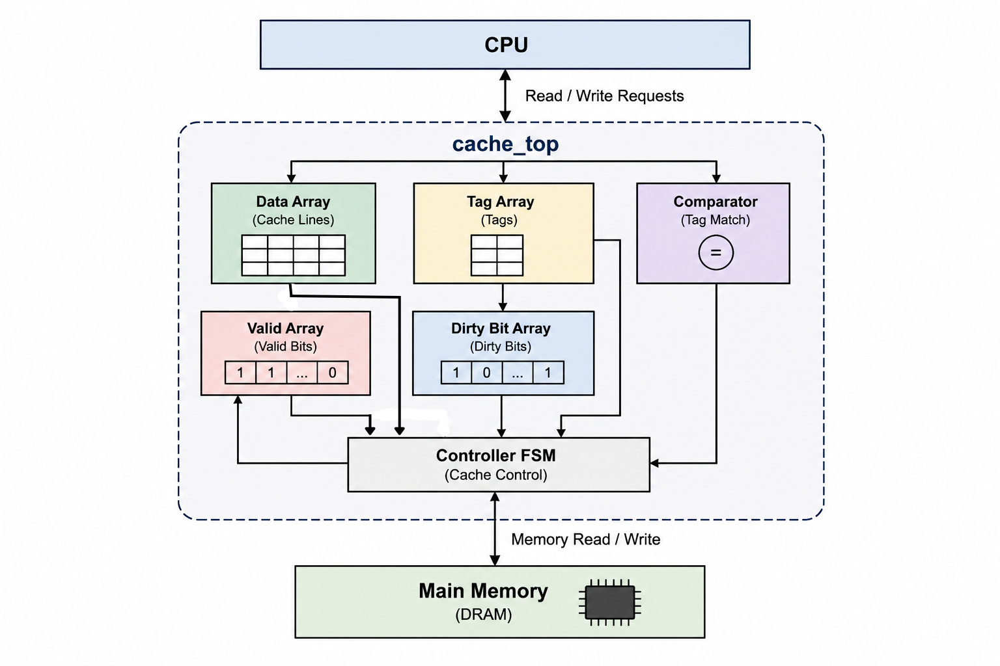

  
# Direct-Mapped Cache Controller

**A parameterized Verilog implementation of a Direct-Mapped Write-Back Write-Allocate Cache Controller with configurable memory latency.**

---

## Project Overview

This project presents the design and implementation of a parameterized **Direct-Mapped Cache Controller** using Verilog HDL. The cache follows a **Write-Back** and **Write-Allocate** policy to improve memory access efficiency by reducing the average memory access time.

The controller supports cache read and write operations, cache hit and miss detection, dirty bit management, valid bit tracking, tag comparison, and communication with the main memory. A configurable memory latency model is also included to emulate realistic memory behavior.

The design has been developed using modular RTL architecture, verified through simulation, and organized for easy scalability and reuse.

## Features

- Direct-Mapped Cache Architecture
- Write-Back Cache Policy
- Write-Allocate Policy
- Parameterized Cache Design
- Configurable Main Memory Latency
- Cache Hit and Cache Miss Detection
- Tag Comparison Logic
- Valid Bit and Dirty Bit Management
- Separate Data, Tag, Valid, and Dirty Arrays
- Modular RTL Design for Easy Reusability
- External Memory Initialization using `$readmemh`
- Functional Verification using a Verilog Testbench

  ## Cache Specifications

| Parameter | Value |
|----------|-------|
| Cache Organization | Direct-Mapped |
| Write Policy | Write-Back |
| Allocation Policy | Write-Allocate |
| Number of Cache Lines | 16 |
| Block Size | 128 bits (16 Bytes) |
| Tag Width | 24 bits |
| Index Width | 4 bits |
| Offset Width | 4 bits |
| Address Width | 32 bits |
| Memory Initialization | `$readmemh()` |
| Main Memory Latency | Configurable |
| RTL Language | Verilog HDL |

## Project Architecture

The cache controller is organized into modular RTL components, separating the control path from the data path. The controller FSM manages cache operations, while dedicated modules handle data storage, tag comparison, valid bits, dirty bits, and communication with the main memory.

  

  <b>Figure 1:</b> Architecture of the Direct-Mapped Write-Back Write-Allocate Cache Controller.

